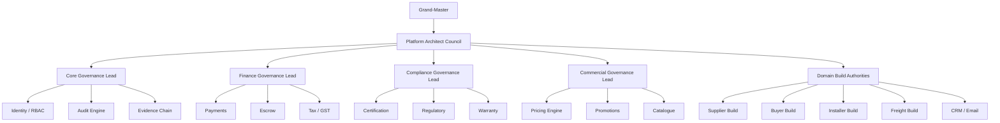

# PLATFORM DESIGN AUTHORITY HIERARCHY

Document ID: RRE-00-PLATFORM-AUTHORITY-HIERARCHY-v1.0  
Version: v1.0  
Status: LOCKED  
Category: 00 – Project Definition & Governance  
Authority Level: Design Authority Only  
Runtime Authority Impact: NONE  
Change Control: REQUIRED for any modification

## 1) Purpose

This document defines the platform design-authority hierarchy governing:
- platform improvements,
- upgrade approvals,
- Core vs Extension boundary decisions,
- structural system evolution.

This authority layer is non-operational and does not alter runtime marketplace permissions.

## 2) Scope Boundaries

This hierarchy governs design evolution only. It does not govern:
- buyer or supplier runtime transactions,
- operational role assignment in production,
- backend RBAC enforcement behavior.

Runtime RBAC identifiers, audit role keys, and server enforcement logic remain unchanged.

## 3) Authority Hierarchy

```text
                              GRAND-MASTER
                     (Immutable Platform Authority Owner)
                                      │
                          PLATFORM ARCHITECT COUNCIL
                                      │
 ────────────────┬───────────────┬───────────────┬───────────────
 CORE GOV LEAD   FINANCE GOV     COMPLIANCE GOV   COMMERCIAL GOV
                 LEAD            LEAD             LEAD
                                      │
                              DOMAIN BUILD AUTHORITIES
         ────────────────┬───────────────┬───────────────┬───────────────
         Supplier Build  Buyer Build     Installer Build  Freight Build
         CRM / Email     Marketing       Pricing          etc.
```

## 4) Role Definitions

### Grand-Master

Authority Scope:
- final design authority over platform architecture,
- appoints and removes governance leads,
- approves extension activation at governance layer,
- can freeze Core structural changes under change-control procedure,
- final dispute resolution for architecture boundaries.

Limitations:
- cannot directly mutate production marketplace business data,
- cannot bypass immutable audit logging,
- cannot disable immutable Core invariants.

### Platform Architect Council

Custodian for:
- Immutable Core doctrine,
- Core vs Extension boundaries,
- governance DMS structure,
- CI enforcement rule posture,
- version lock discipline.

Structural modifications require Council consensus plus Grand-Master ratification.

### Governance Leads

System-level governance ownership across:
- Core Systems,
- Finance Systems,
- Compliance Systems,
- Commercial Systems.

Responsibilities:
- specification updates,
- PASS gate definitions,
- CI enforcement controls,
- regression prevention,
- document updates under change control.

### Domain Build Authorities

Responsible for:
- roadmap proposals,
- feature upgrades,
- API/UI refactor proposals,
- design improvement submissions.

Subject to:
- governance review,
- Core boundary validation,
- CI and CODEOWNERS enforcement.

## 5) Technical Enforcement Mapping

### 5.1 Branch Protection (main)

Mandatory controls:
- required status checks,
- required pull request reviews,
- CODEOWNERS review enforcement,
- conversation resolution before merge,
- enforce admins enabled,
- no force pushes,
- no branch deletion.

Grand-Master override never bypasses CI status checks.

### 5.2 CODEOWNERS Mapping (Reference)

```text
# Immutable Core
/frontend/core/                  @core-governance-lead
/backend/core/                   @core-governance-lead
/docs/07.xx/                     @core-governance-lead

# Finance
/backend/payments/               @finance-governance-lead
/backend/escrow/                 @finance-governance-lead

# Compliance
/backend/compliance/             @compliance-governance-lead

# Commercial
/backend/pricing/                @commercial-governance-lead
/backend/promotions/             @commercial-governance-lead

# Domain Build
/frontend/supplier/              @supplier-build-lead
/frontend/buyer/                 @buyer-build-lead
```

## 6) Mermaid Authority Diagram



## 7) Extension Linkage

This hierarchy is governed under:
- Extension ID: `EXT-GOV-AUTH-01`
- Name: Platform Design Authority Framework
- Activation Level: Mandatory (design governance only)
- Runtime Authorization Impact: NONE

## 8) Authority Dashboard Visibility

Planned read surface:
- `/admin/governance/authority`

Displayed controls:
- authority tree,
- assigned governance leads,
- effective version,
- hash reference,
- approval log.

Read-only for non Grand-Master.

## 9) Violation Handling

On authority-governance breach:
- freeze merges,
- notify Platform Architect Council,
- generate governance incident,
- record immutable audit event.

## 10) Change Control

Any change to hierarchy, scope, mapping, override rules, or enforcement semantics requires:
- formal change-control request,
- document version increment,
- updated SHA-256 manifest,
- DMS index update,
- board ratification update.

No exceptions.

## 11) Lock Declaration

This document is lock-ready and becomes active as a locked governance artefact upon:
- SHA-256 manifest registration in DMS,
- corresponding board resolution ratification.
